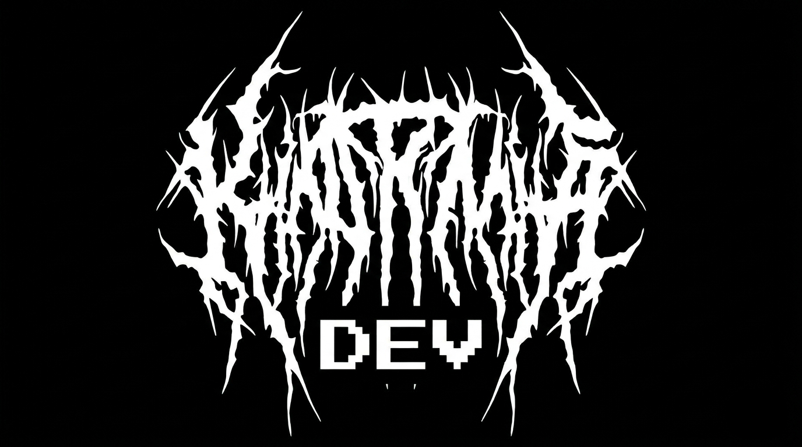

<div align="center">
    
</div>

<h1 align="center">Hey 👋, I'm Karma</h1>
<h3 align="center">Building real projects. Not tutorials.</h3>

<p align="center">
  <a href="https://github.com/KarmaDevz">
    
  </a>
</p>

---

## 🧠 About Me

- 🚀 I build real-world tools
- 🎯 Focused on performance & automation
- 💻 Python & Kotlin developer
- 🔥 Turning ideas into deployable software

---

## 🛠 Tech Stack

```text
Python • Kotlin • Git • Linux • Automation • APIs • Discord Integrations
```

---

## 🚀 Featured Projects

### 🎮 GeForce-NOW Rich Presence
Automatically show your GeForce NOW games as Discord Rich Presence.  
Detect games and sync status live.

> Python • Discord RPC • Automation

---

### 🛡 AuditShield
Application to manage preventive ISO 27001 audits.

> Kotlin • Desktop App • Structured Validation

---

## 📊 GitHub Stats

<p align="center">
  
</p>

<p align="center">
  
</p>

---

## 🧩 Currently Building

- ⚡ Advanced automation tools
- 🔐 Security-oriented applications
- 🎮 Gaming integrations

---

## 📫 Contact

- Discord: karmadevz
- GitHub Issues always open

---

<p align="center">
  ⚡ “Consistency beats motivation.”
</p>