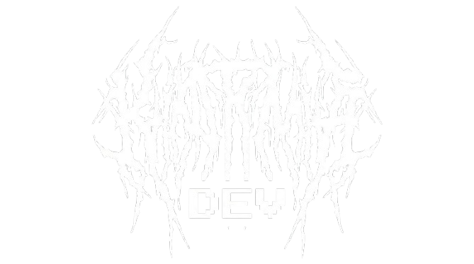

    

<h1 align="center">Karma</h1>
<h3 align="center">Building real projects. Not tutorials.</h3>

  
  

---

## 🧠 About Me

I am a passionate developer focused on **performance**, **automation**, and creating **deployable software**. I thrive on building tools that solve real-world problems.

- � Currently building **advanced automation tools** and **gaming integrations**
- 🔐 Strong interest in **security-oriented applications**
- 💻 Specialized in **Python** & **Kotlin**
- 📫 Reach out via Discord: **`karmadevz`**

---

## 🛠 Tech Stack

  
  
  
  
  

---

## 🚀 Featured Projects

<table bordercolor="#30363d">
  <tr>
    <td width="50%" valign="top">
      <h3 align="center">🎮 GeForce-NOW Rich Presence</h3>
       
      

        Automatically show your <b>GeForce NOW</b> games as Discord Rich Presence. Detects games and syncs status live.
      

      

        <code>Python</code> • <code>Discord RPC</code> • <code>Automation</code>
      

    </td>
    <td width="50%" valign="top">
      <h3 align="center">🛡 AuditShield</h3>
       
      

        Desktop application designed to manage preventive <b>ISO 27001 audits</b> with structured validation.
      

      

        <code>Kotlin</code> • <code>Desktop App</code>
      

    </td>
  </tr>
</table>

---

## 📊 GitHub Stats

  
  

  

---

  ⚡ <i>“Consistency beats motivation.”</i>

